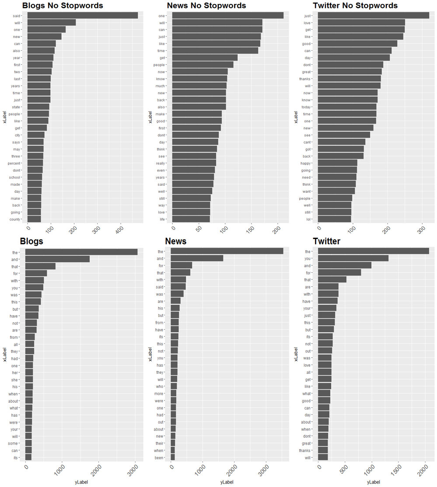
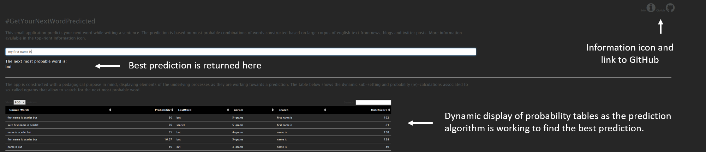

Coursera Data Science Capstone
========================================================
author: Pierre Saouter	
date: 11/28/2017
css: rpres_customcss.css
font-family: 'Helvetica'
autosize: true
width: 960
height: 700

[#GetYourNextWordPredicted](https://thachtranerc.wordpress.com/2016/04/12/katzs-backoff-model-implementation-in-r/)
is an interactive dashboard that predicts the next most probable word a user intends to write

The application runs on a public Shiny server at the link below: 
[https://datasciencebackwords.shinyapps.io/GetYourNextWordPredicted/](https://datasciencebackwords.shinyapps.io/GetYourNextWordPredicted/) 
The R code used to build the app is available here: 
[https://github.com/ppssphysics](https://github.com/ppssphysics)

Introduction to the Project
========================================================

Before proposing an interactive application to the user, a number of steps have been followed:

 1. Data preparation 
 

Exploration and cleaning of available sources of texts in order to built frequency table of most probable combinations of 1,2,3,4 and 5 words, so-called ngrams. Available corpus of texts were of three types: news, blogs and twitter posts.

  2. Building a prediction algorithm 
 

Development of a prediction algorithm based on text searching functionalities in the ngram tables and calculation of associated probabilities. The algorithm is built to return a prediction even if an exact match of the text input by the user is not found.

 3. Building a shiny application 
 

Development of a responsive and engaging application for word prediction available to any user. The application focuses on being fast and responsive, therefore allowing for a compromise to lower prediction accuracy.

Data preparation
========================================================

Due to limited computing ressources, a pre-scaling factor of roughly 99% is applied to the available corpus of texts before building the ngrams (random re-sampling to minimize bias).Text mining applied: all characters to lower case, removing punctuation/numbers, urls, subsitution of few abreviations by a word (twitter content). All details can be found [here](http://rpubs.com/ppss85/324013).  
Ngrams built up to the fifth order and we results studied by text source type to search for any strong specificities that could lead to biases in the prediction (see right plots comparing results of word frequencies for unigrams when including or not stopwords).

***

Building a prediction algorithm
========================================================

  Based on a user's text input, the prediction works as follows:
 

1. The text input is run through the same text cleaning process as for building the ngrams 
2. The words are matched against all word combinations available in the ngrams (exact and partial matches returned)  
3. A matching score for the next word inferred from each combination to be the next one is calculated  
4. The next word associated to the combination with highest match score is returned

The <b>matching score</b> is calculated by using a given combination's probability in the ngram, the frequency of a given word prediction accross all combinations and the number of words from the input matched. The probability calculation was inspired by Katz's Backoff [model](
https://thachtranerc.wordpress.com/2016/04/12/katzs-backoff-model-implementation-in-r/) but eventually become a custom calculation. A proper implentation of Katz's Backoff model or the use of Kneser-Ney technique seem natural steps going further.

At this time, the algorithm is found to under-perform with a predication accuracy estimated to be around 48% to 60%. This seems to be largely attributable to low quality ngrams (in terms of completeness/representativeness) rather than due to the matching score.

Shiny application and future prospects
========================================================

</img> 

The [online application](https://datasciencebackwords.shinyapps.io/GetYourNextWordPredicted/) was built with a strong focus
on making the product as user friendly as possible (this includes fast reactiveness and responsiveness) while offering a possiblity for the user to see the prediction model work in real time (display of probability tables).   The user only has to input text in the white input bar.  

With the framework of the application in place, the biggest area of improvement lies in building more complete ngrams tables as the prediction is under-performing at this time. I am sure that working in your company and benefiting from your infrastructures and expertise would allow to scale this product to a whole other perspective.
 

*The application proposes a Information icon on the top-right corner that provides the user with additional information on the functionning of the application.

